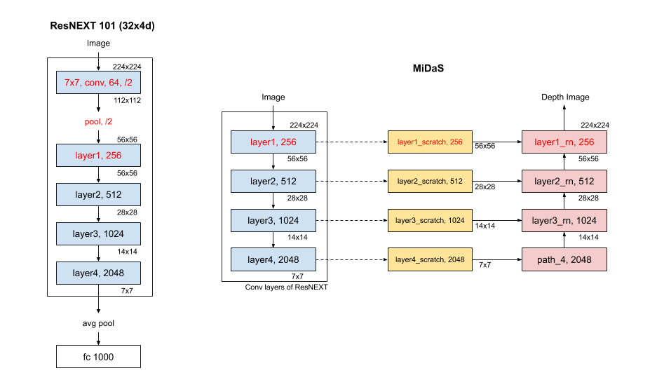
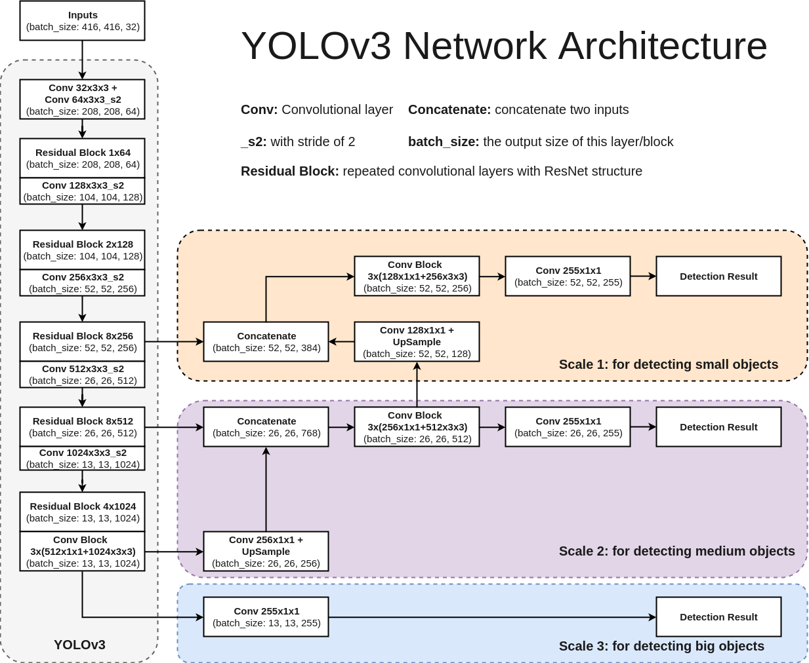
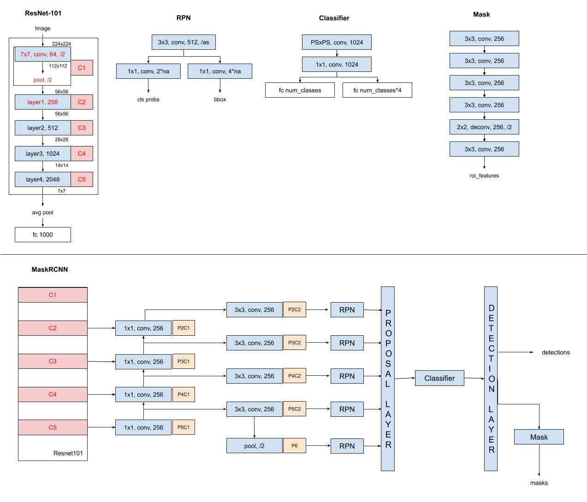

# Building a single model to perform Object Detection, Depth Estimation and Planes detection on an image

* There are three separate outputs which has three separate models. In this project, we'll integrate them into a single model:
  * Object Detection using YoloV3
  * Depth Estimation using MiDaS
  * 3D Planes Detection using PlanerRCNN
* Depth/Panes detection output size is same as input size and hences uses Encoder/Decoder architectures

#### **MiDaS**
* Uses resnext101_32x8d_wsl model with pretrained weights from PyTorch Hub: `facebookresearch/WSL-Images`

  

* Above is ResNEXT 50 (in the right) with Cardinality set to 32 and 4d i.e. residual layer channels start with 128 (4xC=4x32=128). A similar model is used in MiDaS but more parameters i.e. ResNEXT101 with 8d i.e. residual layer channels start with 256 (8xC=8x32=256). This has 4 residual layers.

* Following is a simplified diagram of its architecture:
  
* Above is a good base model to start with i.e. use the pretrained model of MiDaS network and then train the other parts of the final model. MiDaS is chosen as base model for two reasons:
  1. ResNeXt is a common network across all the three models
  2. Training code for MiDaS is not available, hence it is good to use the pretrained weights for this model

#### **YoloV3**

* Following is the architecure of YoloV3:

* As seen above, it is using ResNet. We'll use ResNeXt branch of MiDaS network and then add three branches to get three scales of output of Yolo network
* So the ResNeXt branch will have pretrained weights of MiDaS network and the output branches will be initialised with pretrained weights of YoloV3 and will later be fine tuned as part of combined training
* Yolo output branches will be connected to ResNeXt branch with additional convolutional layers which will be trained as part of training

#### **PlaneRCNN**

* Following is a simplified architecture of PlaneRCNN model:

* As seen above it is a combination of multiple network, but we have common ResNet network here. Hence we can extend MiDaS's ResNeXt branch to incorporate planeRCNN network
* Similar to YoloV3 model, we will load MiDaS's ResNeXt branch with pretrained model and all the other parts of planeRCNN model will have its own pretrained weights which will be trained

#### Conclusion
* As part of this project, I understood all the models
* Was able to combine MiDaS and YoloV3 model and train the network. But results are not at all satisfactory
* Work is in progress to combine PlaneRCNN model
